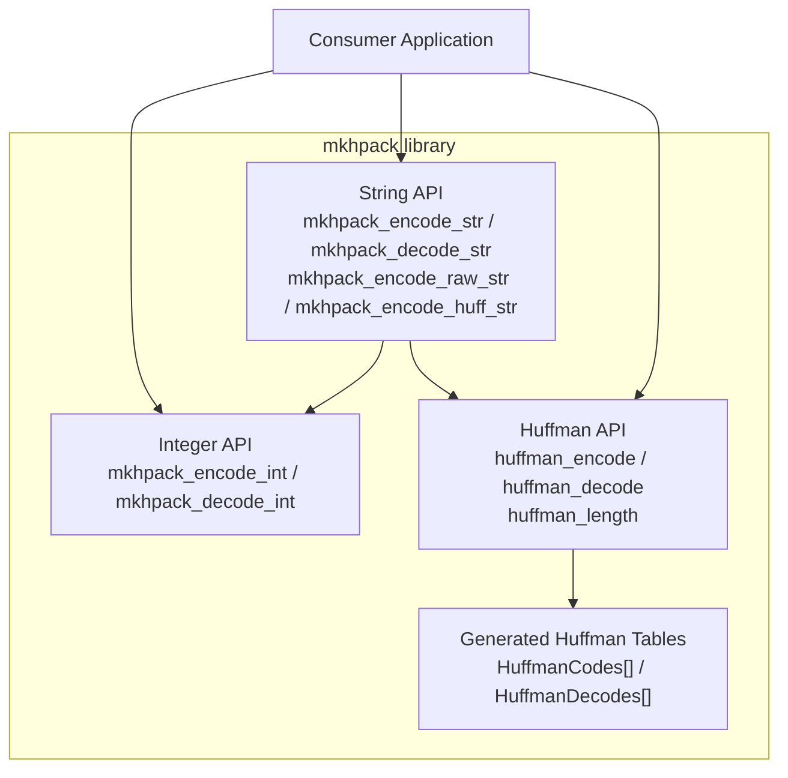
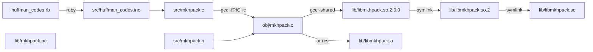

# Architecture

## System Overview

mkhpack is a C library that implements the low-level encoding and decoding
primitives defined in [RFC 7541](https://www.rfc-editor.org/rfc/rfc7541.html)
(HPACK: Header Compression for HTTP/2). It is a stateless, single-file library
with no runtime dependencies beyond the C standard library.

The library currently covers:

- **Integer representation** (RFC 7541 §5.1) — variable-length integer encoding
  with configurable prefix widths
- **Huffman coding** (RFC 7541 §5.2, Appendix B) — encoding, decoding, and
  length calculation using the HPACK Huffman table
- **String literal representation** (RFC 7541 §5.2) — raw and Huffman-encoded
  string framing with automatic Huffman optimisation

Full HPACK dynamic/static table support and header field representation are
planned for the future.

## Component Architecture



## Module Breakdown

### Public API (`src/mkhpack.h`)

Declares all exported function signatures, the `MKHPACK_INT_T` type alias, and
include guards. This is the only header consumers need.

### Error Codes (`src/mkhpack_errors.h`)

Defines the five error constants used across all API functions:

| Code | Name | Meaning |
|------|------|---------|
| 0 | `ERROR_NONE` | Success |
| 1 | `ERROR_OVERFLOW` | Output buffer full |
| 2 | `ERROR_TRUNCATED` | Input buffer exhausted mid-value |
| 3 | `ERROR_EOS` | Invalid Huffman code (EOS symbol encountered) |
| 4 | `ERROR_BAD_PREFIX` | Invalid prefix width or prefix byte |

### Implementation (`src/mkhpack.c`)

Single-file implementation containing all encoding and decoding logic. Includes
`huffman_codes.inc` for the generated Huffman lookup tables.

### Generated Tables (`src/huffman_codes.inc`)

Contains two C arrays generated by `huffman_codes.rb`:

- `HuffmanCodes[]` — an array of `hnode_t` structs (bit pattern + bit length)
  used by the encoder, indexed by input byte value (0–256)
- `HuffmanDecodes[]` — a flat binary trie of `uint32_t` values used by the
  decoder, where each entry packs two 16-bit child pointers (zero-bit and
  one-bit branches)

## Data Flow

### Integer encoding

```text
Input integer + prefix config
        │
        ▼
  mkhpack_encode_int()
        │
        ├─ Fits in prefix bits? → single byte output
        │
        └─ Exceeds prefix? → prefix byte + variable-length continuation bytes
                              (7-bit groups with continuation flag)
```

### Integer decoding

```text
Encoded byte sequence
        │
        ▼
  mkhpack_decode_int()
        │
        ├─ Extract prefix bits from first byte
        │
        └─ If all prefix bits set → read continuation bytes
                                    (7-bit groups until continuation flag clear)
        │
        ▼
  Decoded integer + prefix remainder
```

### String encoding (`mkhpack_encode_str`)

```text
Input string
        │
        ▼
  huffman_length()  →  Compare Huffman length vs raw length
        │
        ├─ Huffman shorter? → mkhpack_encode_int(length, HUFFMAN_FLAG)
        │                     + huffman_encode(string)
        │
        └─ Not shorter?    → mkhpack_encode_int(length, 0x00)
                              + raw memcpy(string)
```

### Huffman decoding

```text
Huffman-encoded bytes
        │
        ▼
  huffman_decode()
        │
        ├─ Walk HuffmanDecodes[] trie bit-by-bit
        │
        ├─ Leaf node (IS_INT flag set)? → emit decoded byte, reset trie
        │
        ├─ Internal node? → follow branch based on next bit
        │
        ├─ End of input with valid padding? → success
        │
        └─ End of input mid-code or EOS? → error
```

## Build Architecture


